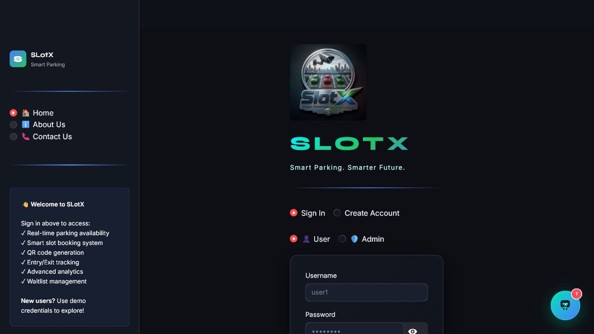
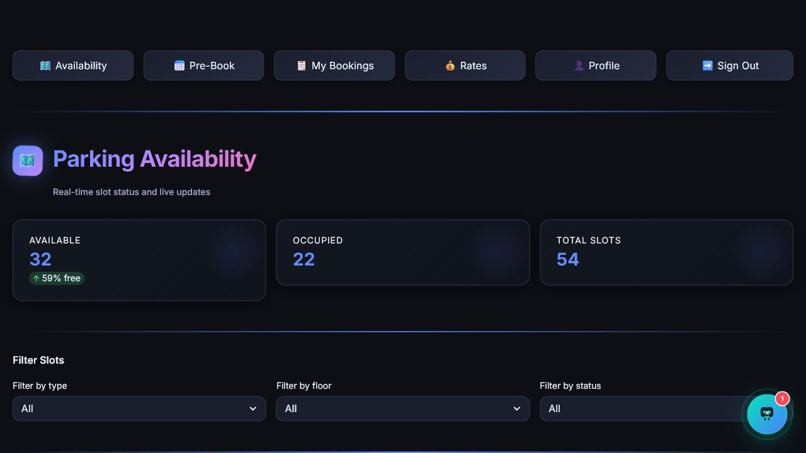
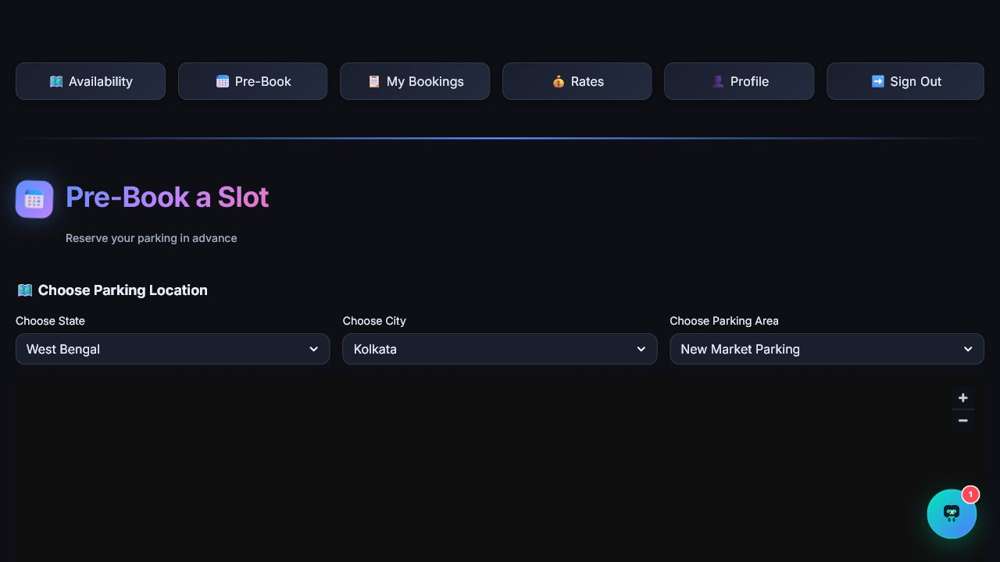
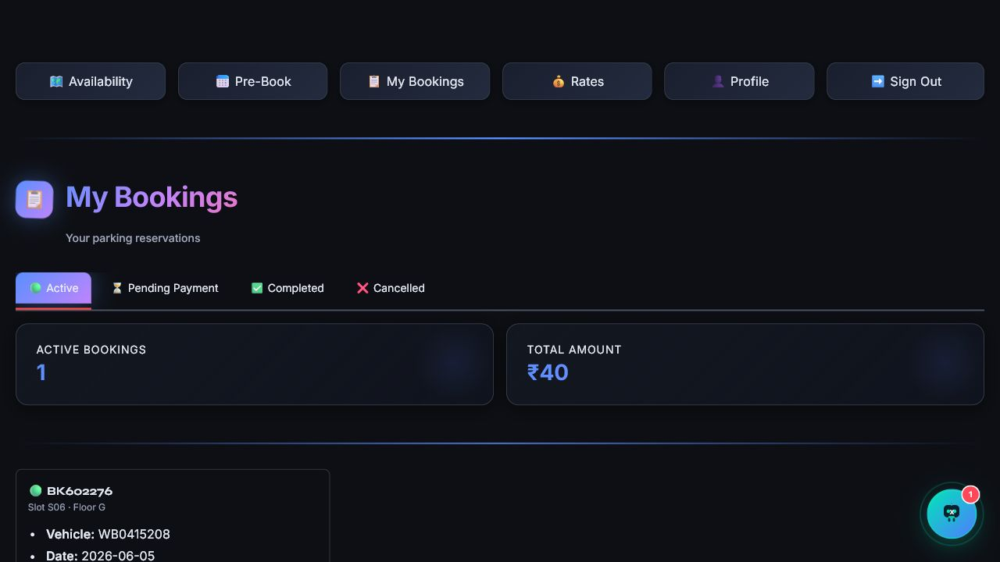
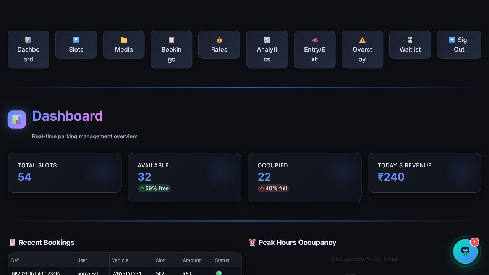
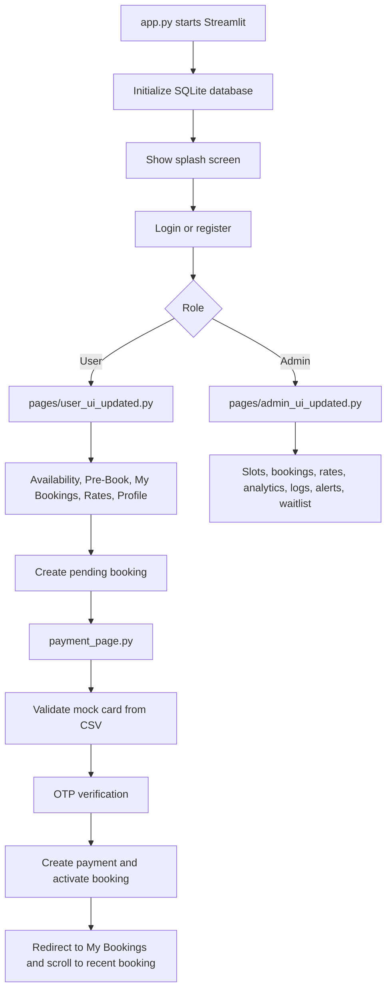

# SlotX Smart Parking Management System

SlotX is a Streamlit-based smart parking application for booking parking slots, managing payments, viewing QR-enabled bookings, and administering parking operations. It uses SQLite for local persistence and includes separate user and admin portals, a mock card payment gateway, waitlist support, analytics, entry/exit logs, overstay alerts, media uploads, and a floating assistant named XARA.

## Table of Contents

- [Features](#features)
- [Screenshots](#screenshots)
- [Tech Stack](#tech-stack)
- [Project Structure](#project-structure)
- [Getting Started](#getting-started)
- [Demo Credentials](#demo-credentials)
- [How the App Works](#how-the-app-works)
- [Code Walkthrough](#code-walkthrough)
- [Database Design](#database-design)
- [Mock Payment Gateway](#mock-payment-gateway)
- [Important Workflows](#important-workflows)
- [Configuration and Data Files](#configuration-and-data-files)
- [Troubleshooting](#troubleshooting)

## Features

### User Portal

- Splash screen and sign-in/sign-up experience.
- Real-time parking availability view grouped by floor.
- Slot filtering by vehicle type, floor, and status.
- Pre-booking flow with vehicle number, date, time, duration, slot selection, and fare calculation.
- Pending payment handling for newly created bookings.
- Mock card payment gateway with:
  - Credit card and debit card selection.
  - Valid card tables displayed for the selected card type.
  - OTP verification sent by email through SMTP.
  - Full-screen payment processing animation.
  - Automatic redirect back to My Bookings.
  - Automatic scroll to the most recent paid booking.
- My Bookings view with Active, Pending Payment, Completed, and Cancelled tabs.
- QR code generation for active bookings.
- Waitlist support when a preferred slot is unavailable.
- User profile update flow.
- Floating XARA chatbot for booking, payment, slot, and QR help.

### Admin Portal

- Dashboard with operational summary.
- Parking slot grid and management tools.
- Add/edit/delete/toggle parking slots.
- Booking administration.
- Parking rate management.
- Analytics and revenue summaries.
- Entry/exit log view.
- Overstay alert management.
- Waitlist monitoring.
- Media upload records.

## Screenshots

### Splash Screen


### Login and Demo Credentials



### User Parking Availability



### Pre-Booking Flow



### My Bookings



### Admin Dashboard



## Tech Stack

- Python 3.x
- Streamlit 1.36.0
- SQLite via Python `sqlite3`
- Pandas
- Matplotlib
- NumPy
- qrcode
- Pillow
- Folium and streamlit-folium
- HTML/CSS embedded in Streamlit for custom UI styling and animations

## Project Structure

```text
parking-space-detector-app/
├── app.py
├── payment_page.py
├── parksync.db
├── requirements.txt
├── README.md
├── slotx_logo.jpeg
├── splash_video.mp4
├── docs/
│   └── screenshots/
│       ├── 01-splash.png
│       ├── 02-login.png
│       ├── 03-user-availability.png
│       ├── 04-pre-book.png
│       ├── 05-my-bookings.png
│       └── 06-admin-dashboard.png
├── pages/
│   ├── admin_ui_updated.py
│   ├── chatbot.py
│   └── user_ui_updated.py
├── payments/
│   ├── valid-credit-card.csv
│   └── valid-debit-card.csv
├── uploads/
└── utils/
    ├── chatbot_utils.py
    ├── database.py
    └── styles.py
```

## Getting Started

### 1. Clone or Open the Project

Open the respective folder where project is cloned in your editor or terminal:

```powershell
cd /path/to/project
```

### 2. Create and Activate a Virtual Environment

```powershell
python -m venv .venv
.\.venv\Scripts\Activate.ps1
```

### 3. Install Dependencies

```powershell
pip install -r requirements.txt
```

### 4. Run the App

```powershell
streamlit run app.py
```

The app usually opens at:

```text
http://localhost:8501
```

## Demo Credentials

| Role | Username | Password |
| --- | --- | --- |
| User | `user1` | `pass123` |
| User | `user2` | `pass123` |
| User | `user3` | `pass123` |
| Admin | `admin` | `admin123` |

These accounts are seeded by `init_db()` in `utils/database.py` when the SQLite database is initialized.

## How the App Works



## Code Walkthrough

### `app.py`

`app.py` is the Streamlit entry point. It:

- Calls `init_db()` to create and seed the SQLite database.
- Sets Streamlit page configuration.
- Loads the global theme.
- Renders the splash screen with `splash_video.mp4`.
- Handles login, registration, role selection, and session defaults.
- Routes authenticated users to:
  - `render_user()` from `pages/user_ui_updated.py`
  - `render_admin()` from `pages/admin_ui_updated.py`

Important session keys:

| Key | Purpose |
| --- | --- |
| `logged_in` | Tracks whether a user is authenticated. |
| `user` | Stores the authenticated user row. |
| `role` | Stores `user` or `admin`. |
| `intro_done` | Controls splash screen visibility. |
| `auth_mode` | Switches between login and registration. |

### `pages/user_ui_updated.py`

This file contains the customer-facing portal.

Main responsibilities:

- Sidebar navigation.
- Availability dashboard.
- Pre-booking form.
- My Bookings tabs.
- QR code rendering.
- Waitlist entry.
- Rates view.
- Profile management.
- Footer dialogs.

Key functions:

| Function | Responsibility |
| --- | --- |
| `render_user()` | Main user portal router. |
| `_availability()` | Shows real-time parking slots and filters. |
| `_pre_book()` | Creates pending bookings and calculates amount due. |
| `_my_bookings()` | Shows active, pending, completed, and cancelled bookings. |
| `_display_bookings_grid()` | Renders active bookings and scrolls to the newest paid booking when needed. |
| `_display_pending_bookings()` | Shows pending bookings with Pay Now and Cancel actions. |
| `_qr_dialog()` | Shows a large QR code dialog for an active booking. |
| `_profile_page()` | Updates user profile information. |

After a payment finishes, `payment_page.py` stores `scroll_to_booking_ref` in session state. `_my_bookings()` reads that value and `_display_bookings_grid()` scrolls to the matching active booking card.

### `payment_page.py`

This file implements the mock payment gateway.

Main responsibilities:

- Load valid debit and credit card data from CSV files.
- Display the correct card table for the selected card type.
- Validate card number, CVV, expiry, cardholder name, and OTP.
- Show a full-screen processing animation.
- Create the payment record.
- Activate the booking.
- Send a payment confirmation notification.
- Redirect to My Bookings.

Key functions:

| Function | Responsibility |
| --- | --- |
| `_load_valid_cards()` | Loads card records for validation. |
| `_load_card_rows()` | Loads card records for display as a table. |
| `verify_card_details()` | Checks card data against the mock CSV store. |
| `render_payment()` | Renders the payment page for a booking reference. |
| `_render_card_payment()` | Handles card form and OTP form. |
| `_render_available_cards_table()` | Shows debit or credit card details based on selected type. |
| `_render_payment_processing_animation()` | Shows the full-screen processing animation. |
| `_process_card_payment()` | Creates payment, activates booking, redirects to My Bookings. |

### `pages/admin_ui_updated.py`

This file contains the admin portal.

Main responsibilities:

- Dashboard overview.
- Slot grid and floor map.
- Slot creation, editing, deletion, and status toggling.
- Booking management.
- Rate management.
- Revenue analytics.
- Entry/exit log review.
- Overstay alert review.
- Waitlist monitoring.
- Uploaded media review.

Key functions:

| Function | Responsibility |
| --- | --- |
| `render_admin()` | Main admin router. |
| `_dashboard()` | Shows summary metrics and recent activity. |
| `_slots_page()` | Manages parking slots. |
| `_bookings_page()` | Lists and manages bookings. |
| `_rates_page()` | Updates parking rates. |
| `_analytics_page()` | Shows revenue and booking analytics. |
| `_entry_exit_page()` | Shows gate entry/exit logs. |
| `_overstay_page()` | Shows overstay alerts. |
| `_waitlist_page()` | Shows waitlist records. |

### `utils/database.py`

This is the persistence layer. It uses SQLite and returns dictionaries or lists of dictionaries for Streamlit pages.

Main responsibilities:

- Connect to `parksync.db`.
- Create database tables.
- Seed demo users, admin, parking slots, rates, and sample bookings.
- Authenticate and register users.
- Create and update bookings.
- Create and update payments.
- Manage rates, waitlist, notifications, logs, overstay alerts, and media records.

### `utils/styles.py`

This file centralizes custom CSS and UI helper HTML.

Main responsibilities:

- Apply the dark UI theme.
- Generate styled badges.
- Render animated slot cards.
- Render rate cards.
- Render section headers and content cards.

### `utils/chatbot_utils.py` and `pages/chatbot.py`

These files implement XARA, the SlotX assistant.

Main responsibilities:

- Provide canned responses for common parking, booking, payment, waitlist, and QR questions.
- Render the floating assistant widget.
- Maintain chat messages in Streamlit session state.

## Database Design

The app stores data in `parksync.db`. The schema is created in `utils/database.py`.

| Table | Purpose |
| --- | --- |
| `users` | Login accounts for users and admins. |
| `parking_slots` | Slot code, floor, vehicle type, and status. |
| `bookings` | Booking reference, user, slot, vehicle, date/time, amount, and status. |
| `payments` | Payment ID, booking, user, amount, method, status, transaction reference. |
| `rates` | Hourly rates for 2-wheelers and 4-wheelers. |
| `media_uploads` | Uploaded media metadata. |
| `waitlist` | Waitlist entries for unavailable slots. |
| `entry_exit_logs` | Gate entry and exit records. |
| `notifications` | User notifications. |
| `overstay_alerts` | Overstay records and penalty tracking. |

## Mock Payment Gateway

The payment flow is intentionally local and mock-based.

### Card Data

Card records are stored in:

```text
payments/valid-credit-card.csv
payments/valid-debit-card.csv
```

CSV format:

```text
cardNumber|cvv|expiry|cardHolderName|otp
```

### Payment Flow

1. User creates a booking from Pre-Book.
2. Booking is saved with `pending` status.
3. User clicks Pay Now.
4. `payment_page.py` opens the payment page.
5. User selects Credit Card or Debit Card.
6. The matching valid card table is shown.
7. Card details are validated against the selected CSV file.
8. The matching CSV OTP is sent by email through the configured SMTP server.
9. OTP stage opens.
10. The matching valid card table is still visible on the OTP page.
11. OTP is validated.
12. Full-screen processing animation is shown.
13. Payment row is created.
14. Booking status changes to `active`.
15. User is redirected to My Bookings.
16. The page scrolls to the most recently paid booking.

### OTP Email Configuration

Email settings are stored outside the payment page in:

```text
config/email.ini
```

For Gmail SMTP, fill in:

```ini
[smtp]
smtpHost = smtp.gmail.com
smtpPort = 587
smtpUseTls = true
smtpUsername = your-gmail-address@gmail.com
smtpPassword = your-gmail-app-password

[message]
emailFrom = your-gmail-address@gmail.com
emailTo = booking_user
emailBcc =
```

`emailTo = booking_user` sends the OTP to the email saved on the booking user profile. You can also set one or more fixed recipients separated by commas. For local secrets, create `config/email.local.ini`; it overrides `config/email.ini` and is ignored by git.

## Important Workflows

### Booking a Slot

1. Sign in as a user.
2. Open Pre-Book.
3. Enter vehicle number.
4. Pick date, time, duration, vehicle type, and floor.
5. Select an available slot.
6. Create the booking.
7. Complete payment from the pending booking/payment page.

### Viewing a QR Code

1. Sign in as a user.
2. Open My Bookings.
3. Use the Active tab.
4. Click "Click to Generate QR".
5. Scan the displayed QR code at the gate.

### Managing Slots as Admin

1. Sign in as admin.
2. Open Slot Management.
3. Use Grid, Floor Map, Add, or Edit tabs.
4. Add new slots or update slot status.

### Updating Rates

1. Sign in as admin.
2. Open Rates.
3. Update hourly rates for vehicle types.
4. New booking amounts use the latest rates.

## Configuration and Data Files

| File | Purpose |
| --- | --- |
| `requirements.txt` | Python package dependencies. |
| `config/email.ini` | SMTP and recipient settings for OTP email delivery. |
| `parksync.db` | Local SQLite database. |
| `slotx_logo.jpeg` | Logo shown on login/splash UI. |
| `splash_video.mp4` | Splash screen video. |
| `payments/valid-credit-card.csv` | Mock valid credit cards. |
| `payments/valid-debit-card.csv` | Mock valid debit cards. |
| `uploads/` | Uploaded media storage area. |
| `docs/screenshots/` | README screenshots. |

## Troubleshooting

### Streamlit command not found

Install dependencies inside the active virtual environment:

```powershell
pip install -r requirements.txt
```

### Port 8501 is already in use

Run on another port:

```powershell
streamlit run app.py --server.port 8502
```

### Login data looks stale

The app persists local data in `parksync.db`. If you want a fresh demo database, stop Streamlit, back up or remove `parksync.db`, and run the app again so `init_db()` can recreate seed data.

### Payment card is rejected

Make sure the selected card type matches the CSV that contains the card. Credit cards are checked against `valid-credit-card.csv`; debit cards are checked against `valid-debit-card.csv`.

### Screenshots do not render on GitHub

Confirm the files exist under:

```text
docs/screenshots/
```

## Notes for Future Development

- Replace the CSV-backed mock gateway with a real payment provider only after moving secrets into environment variables.
- Add automated tests around booking creation, payment activation, and admin slot updates.
- Consider migrating from raw SQLite helper functions to an ORM if the schema grows.
- Add role-based authorization checks around admin database operations.
- Store uploaded media outside the repository for production deployments.
